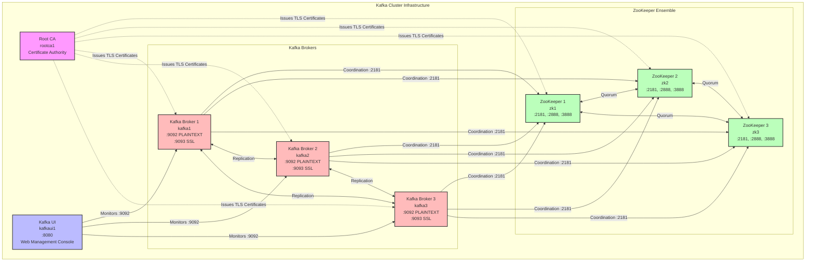

# Kafka Ansible Collection
[](LICENSE)

An Ansible collection for deploying production-grade Apache Kafka clusters with ZooKeeper coordination and TLS security. This project demonstrates AI-assisted development methodology with comprehensive Molecule testing.

LinkedIn Article Writeup:
- https://www.linkedin.com/pulse/how-i-get-10x-more-value-from-github-copilot-using-one-herman-wong-3xotc/

Video Demo:
- https://www.youtube.com/watch?v=qMzQdLTZNAQ
  - Full length, 37:06
- https://vimeo.com/1153847231
  - Trimmed, 1.25x speed, 22:14

## 🎯 Features

- **Production-grade Kafka deployment** with 3-node broker cluster
- **ZooKeeper ensemble** (3 nodes) for cluster coordination
- **TLS encryption** with self-signed Root CA for secure communications
- **Multi-platform support** for Rocky Linux 9 and Ubuntu 22.04
- **Comprehensive testing** using Molecule with systemd-enabled containers
- **AI-assisted development** workflow demonstration

## 📋 Architecture



**Total Nodes:** 8 (1 CA + 3 ZooKeeper + 3 Kafka brokers + 1 Kafka UI)

### Component Overview

- **Root CA (rootca1)**: Generates self-signed certificates for TLS encryption
- **ZooKeeper Ensemble (zk1-3)**: Distributed coordination service for Kafka cluster
- **Kafka Brokers (kafka1-3)**: Message storage and streaming platform
- **Kafka UI (kafkaui1)**: Web-based management and monitoring interface at [http://localhost:8080](http://localhost:8080)

## 🚀 Quick Start

### Prerequisites

- Python 3.11+
- Docker (for Molecule testing)
- Ansible Core 2.15+

### Installation

```bash
# Clone the repository
git clone https://github.com/AgentWong/kafka-ansible-collection.git
cd kafka-ansible-collection

# Install Python dependencies
pip install -r requirements.txt

# Install Ansible Galaxy dependencies
ansible-galaxy collection install -r requirements.yml
```

### Running Tests

```bash
# Run full Molecule test suite
molecule test

# Run converge only (for development)
molecule converge

# Verify cluster health
molecule verify

# Destroy test environment
molecule destroy
```

## 📦 Roles

| Role | Description |
|------|-------------|
| `common` | Base system configuration, packages, users, and directories |
| `java` | OpenJDK installation (Java 11 or 17) |
| `rootca` | Self-signed Root CA certificate generation |
| `zookeeper` | Apache ZooKeeper cluster deployment with TLS |
| `kafka` | Apache Kafka broker deployment with TLS |

## 🔧 Configuration

### Key Variables

```yaml
# Java
java_version: "17"

# ZooKeeper
zookeeper_version: "3.9.3"
zookeeper_client_port: 2181
zookeeper_tls_enabled: true

# Kafka
kafka_version: "3.7.0"
kafka_tls_enabled: true
kafka_listeners:
  - PLAINTEXT://:9092
  - SSL://:9093
```

See individual role `defaults/main.yml` files for complete variable documentation.

## 📁 Repository Structure

```
kafka-ansible-collection/
├── containers/          # Custom systemd-enabled Docker images
├── docs/               # Additional documentation
├── extensions/molecule/ # Molecule testing configuration
├── inventory/          # Sample inventory files
├── playbooks/          # Deployment playbooks
├── plugins/            # Custom Ansible plugins
└── roles/              # Ansible roles
    ├── common/
    ├── java/
    ├── kafka/
    ├── rootca/
    └── zookeeper/
```

## 🧪 Testing

This project uses Molecule with custom systemd-enabled Docker containers for comprehensive testing. The test infrastructure supports:

- **Rocky Linux 9** - Primary testing platform (RHEL alternative)
- **Ubuntu 22.04** - Secondary testing platform

Tests validate:
- Service installation and configuration
- Cluster formation and leader election
- TLS certificate generation and distribution
- Inter-node communication
- Message production and consumption

## 📄 License

This project is licensed under the Apache License 2.0 - see the [LICENSE](LICENSE) file for details.

## 👤 Author

**Herman Wong**

- GitHub: [@AgentWong](https://github.com/AgentWong)

## 🙏 Acknowledgments

- Apache Kafka and ZooKeeper communities
- Ansible and Molecule development teams
- GitHub Copilot for AI-assisted development