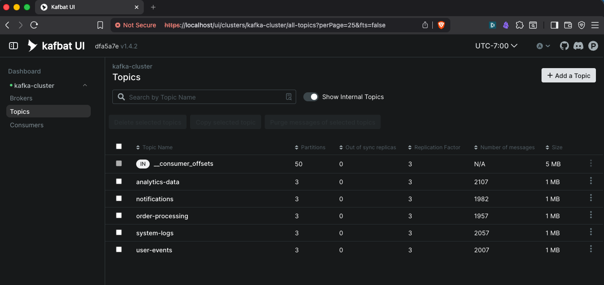
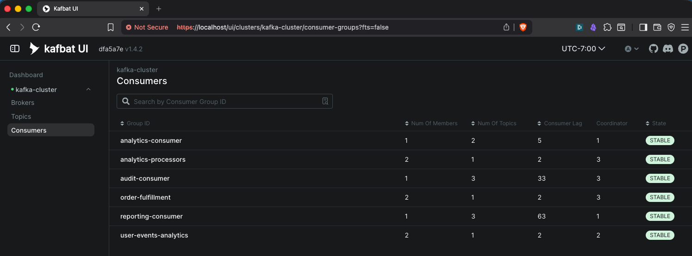
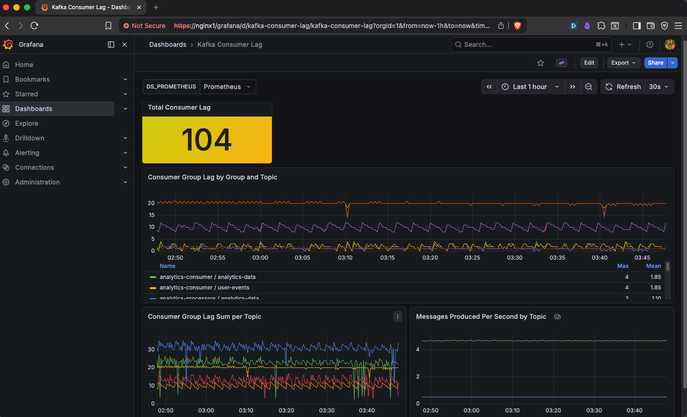
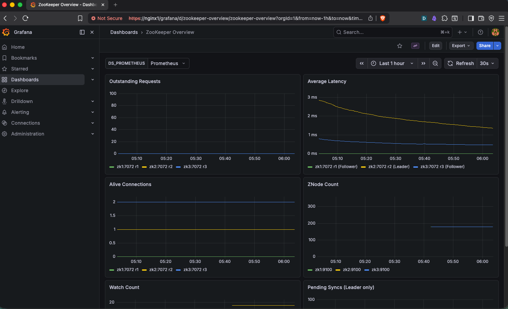
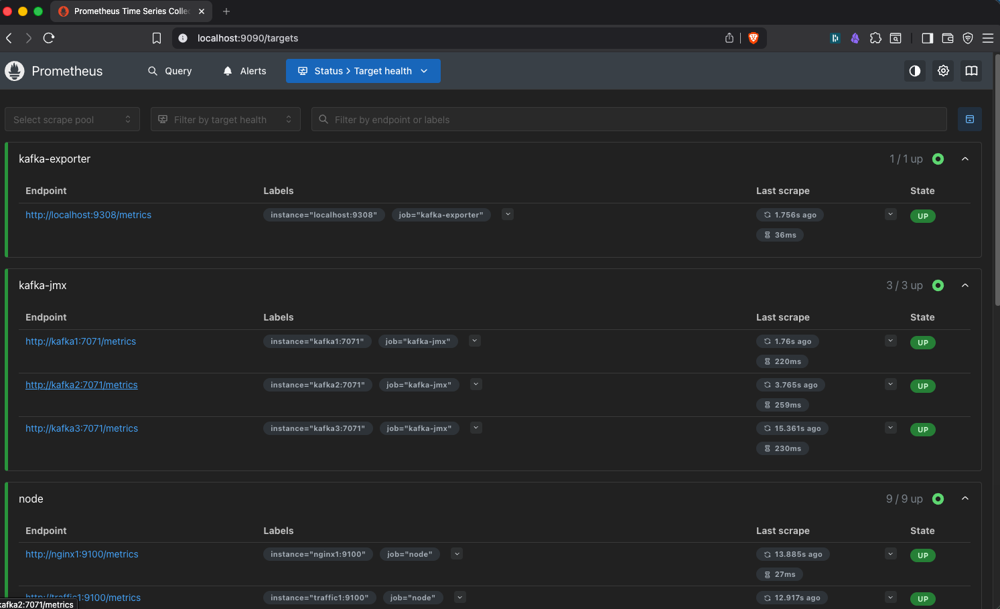
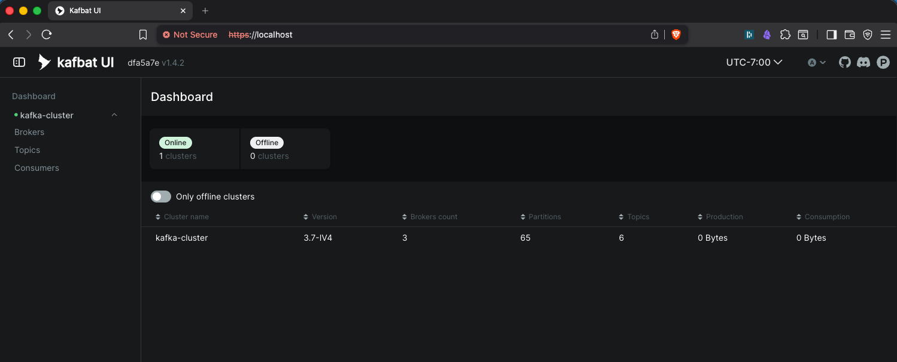

# Kafka Ansible Collection
[](LICENSE)

An Ansible collection for deploying a production-grade Apache Kafka cluster with ZooKeeper coordination, TLS security, and a full Prometheus/Grafana observability stack — all tested via Molecule with Docker.

## At a Glance

| | |
|---|---|
| **Nodes** | 11 containers (Root CA, 3 ZooKeeper, 3 Kafka, Monitoring, Nginx, Traffic Generator, Kafka UI) |
| **Security** | Self-signed Root CA → TLS everywhere (inter-broker, ZooKeeper quorum, Nginx) |
| **Observability** | Prometheus + Grafana + JMX Exporter + kafka_exporter + Node Exporter |
| **Access** | Nginx reverse proxy with HTTPS and basic auth fronting Kafka UI and Grafana |
| **Testing** | Molecule with systemd-enabled Rocky Linux 9 containers |

> For the full architecture diagram and component details, see [docs/ARCHITECTURE.md](docs/ARCHITECTURE.md).

## Screenshots

### Kafka UI — Topics Overview



### Kafka UI — Consumer Groups



### Grafana — Kafka Broker Overview


### Grafana — Consumer Lag



### Grafana — ZooKeeper Overview



### Prometheus — All Targets UP



### Nginx — HTTPS Reverse Proxy



## Quick Start

### Prerequisites

- Python 3.11+
- Docker (for Molecule testing)
- Ansible Core 2.15+

### Installation

```bash
git clone https://github.com/AgentWong/kafka-ansible-collection.git
cd kafka-ansible-collection

pip install -r requirements.txt
ansible-galaxy collection install -r requirements.yml
```

### Running Tests

```bash
# Full test suite (converge + verify + destroy)
molecule test

# Converge only (preserves containers for development)
molecule converge

# Verify cluster health
molecule verify

# Tear down
molecule destroy
```

### Accessing Services After Converge

| Service | URL | Credentials |
|---------|-----|-------------|
| Kafka UI (via Nginx) | https://localhost/ | admin / admin |
| Grafana (via Nginx) | https://localhost/grafana/ | admin / admin |
| Kafka UI (direct) | http://localhost:8080 | — |
| Grafana (direct) | http://localhost:3000 | admin / admin |
| Prometheus | http://localhost:9090 | — |

> Nginx uses a self-signed certificate signed by the cluster Root CA. Accept the browser warning or pass `-k` with curl.

## Observability Stack

### Metrics Pipeline

```
JMX Exporter (java agent)       kafka1-3:7071, zk1-3:7072
kafka_exporter (binary)         monitoring1:9308
Node Exporter (binary)          all nodes:9100
         ↓ scraped every 15s
Prometheus                      monitoring1:9090
         ↓ datasource
Grafana                         monitoring1:3000
         ↓ proxied via
Nginx                           nginx1:443/grafana/
```

### Grafana Dashboards

| Dashboard | Source | Key Metrics |
|-----------|--------|-------------|
| Kafka Broker Overview | Custom JSON | Messages/bytes in/out, under-replicated partitions, request handler idle % |
| Kafka Consumer Lag | Custom JSON | Lag by consumer group and topic, produce rate |
| ZooKeeper Overview | Custom JSON | Latency, outstanding requests, connections, znode count |
| Kafka Exporter Overview | Grafana Labs ID 7589 | Consumer group lag (kafka_exporter data) |
| Node Exporter Full | Grafana Labs ID 1860 | Full system metrics for all nodes |

### Alert Rules

| Alert | Condition | Threshold |
|-------|-----------|-----------|
| `KafkaBrokerDown` | JMX target unreachable | 1 minute |
| `UnderReplicatedPartitions` | Under-replicated partition count > 0 | 2 minutes |
| `ZooKeeperDown` | ZK JMX target unreachable | 1 minute |
| `ConsumerGroupLag` | Consumer lag sum > 1000 | 5 minutes |

### Traffic Generator

The `traffic1` node runs a Python service that continuously produces and consumes messages, creating realistic load for the dashboards:

- **Topics**: `user-events`, `order-processing`, `analytics-data`, `notifications`, `system-logs`
- **Consumer groups**: `analytics-consumer` (1s delay), `audit-consumer` (8s delay), `reporting-consumer` (15s delay) — variable delays create visible consumer lag

## Roles

| Role | Description |
|------|-------------|
| `common` | Base system configuration, packages, users, and directories |
| `java` | OpenJDK 17 installation |
| `rootca` | Self-signed Root CA certificate generation |
| `zookeeper` | Apache ZooKeeper cluster deployment with TLS |
| `kafka` | Apache Kafka broker deployment with TLS |
| `jmx_exporter` | JMX Prometheus Java agent for Kafka and ZooKeeper metrics |
| `nginx` | Nginx reverse proxy with TLS termination and basic auth |

Monitoring components (Prometheus, Grafana, Node Exporter, kafka_exporter) are deployed via Ansible Galaxy collections (`prometheus.prometheus`, `community.grafana`) and Molecule converge tasks rather than custom roles.

## Configuration

See [extensions/molecule/inventory/group_vars/all.yml](extensions/molecule/inventory/group_vars/all.yml) for the full variable reference. Key settings:

```yaml
# Kafka
kafka_version: "3.7.0"
kafka_listeners: "PLAINTEXT://:9092,SSL://:9093"
kafka_inter_broker_listener_name: "SSL"

# ZooKeeper
zookeeper_version: "3.9.3"
zookeeper_tls_enabled: true

# JMX Exporter
jmx_exporter_version: "1.0.1"
jmx_exporter_kafka_port: 7071
jmx_exporter_zookeeper_port: 7072

# Traffic generator
traffic_produce_interval: 2   # seconds between produce batches
traffic_consume_interval: 5   # seconds between consume polls
```

## Repository Structure

```
kafka-ansible-collection/
├── containers/                  # Systemd-enabled Docker images
│   ├── rocky/9/Dockerfile
│   └── ubuntu/22/Dockerfile
├── docs/
│   ├── ARCHITECTURE.md          # Full architecture diagram and component details
│   ├── AI_WORKFLOW.md           # AI-assisted development methodology
│   └── images/                  # Screenshots and workflow diagrams
├── extensions/molecule/
│   ├── config.yml               # Molecule scenario config (11 containers)
│   ├── kafkaui-config.yml       # Kafka UI Spring Boot config
│   ├── default/
│   │   ├── converge.yml         # Main deployment playbook
│   │   ├── converge/            # Modular converge tasks (grafana, kafka-exporter, traffic)
│   │   ├── verify.yml           # Verification tests
│   │   └── verify/              # Modular verify tasks per component
│   ├── files/
│   │   ├── dashboards/          # Grafana dashboard JSON files
│   │   └── traffic_generator.py # Python traffic generator script
│   └── inventory/
│       └── group_vars/all.yml   # All test variables
├── roles/
│   ├── common/
│   ├── java/
│   ├── jmx_exporter/
│   ├── kafka/
│   ├── nginx/
│   ├── rootca/
│   └── zookeeper/
├── requirements.txt             # Python dependencies
└── requirements.yml             # Ansible Galaxy dependencies
```

## AI-Assisted Development

This project was developed using GitHub Copilot Agent Mode with an iterative **setup → fix → test → analyze → repeat** feedback loop. Molecule provided the test harness, enabling the agent to autonomously run converge/verify cycles and fix issues without manual intervention.

> See [docs/AI_WORKFLOW.md](docs/AI_WORKFLOW.md) for the full methodology breakdown with visual slides.

## License

This project is licensed under the Apache License 2.0 — see the [LICENSE](LICENSE) file for details.

## Author

**Herman Wong** — [@AgentWong](https://github.com/AgentWong)
