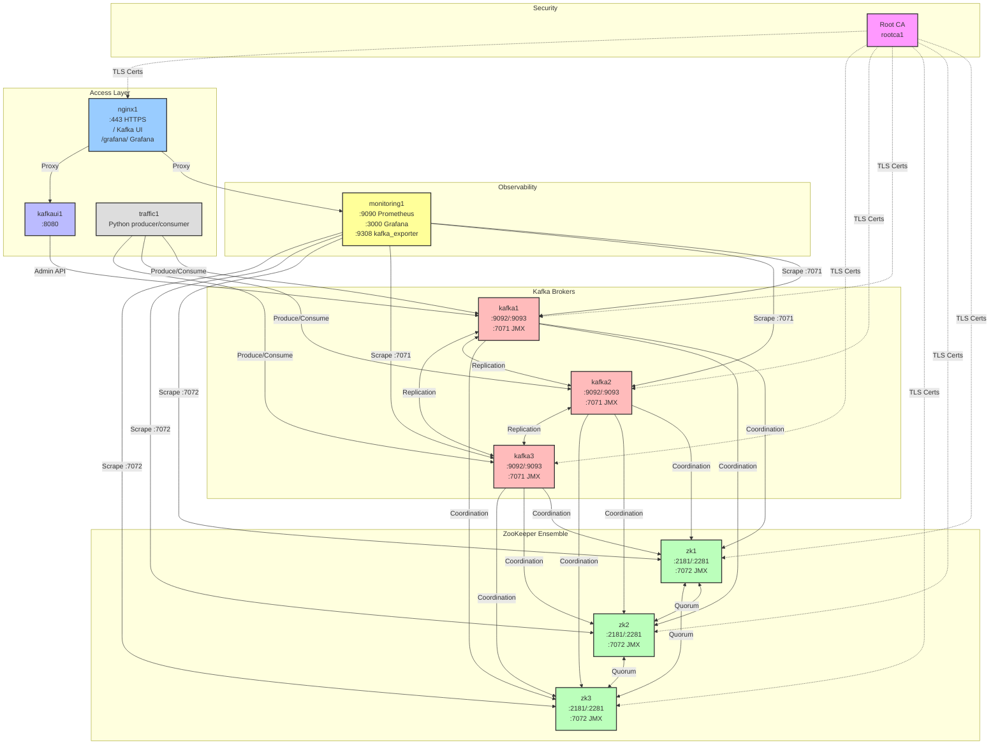

# Kafka Ansible Collection
[](LICENSE)

An Ansible collection for deploying production-grade Apache Kafka clusters with ZooKeeper coordination, TLS security, and a full Prometheus/Grafana observability stack. This project demonstrates AI-assisted development methodology with comprehensive Molecule testing.

LinkedIn Article Writeup:
- https://www.linkedin.com/pulse/how-i-get-10x-more-value-from-github-copilot-using-one-herman-wong-3xotc/

Video Demo:
- https://www.youtube.com/watch?v=qMzQdLTZNAQ
  - Full length, 37:06
- https://vimeo.com/1153847231
  - Trimmed, 1.25x speed, 22:14

## 🎯 Features

- **Production-grade Kafka deployment** with 3-node broker cluster
- **ZooKeeper ensemble** (3 nodes) for cluster coordination
- **TLS encryption** with self-signed Root CA for secure communications
- **Prometheus + Grafana observability** with JMX Exporter, kafka_exporter, and Node Exporter
- **Nginx reverse proxy** with HTTPS and basic auth fronting Kafka UI and Grafana
- **Python traffic generator** producing realistic Kafka workloads with measurable consumer lag
- **Multi-platform support** for Rocky Linux 9 and Ubuntu 22.04
- **Comprehensive testing** using Molecule with systemd-enabled containers
- **AI-assisted development** workflow demonstration

## 📋 Architecture


```mermaid
graph TB
    subgraph "Security"
        CA[Root CA<br/>rootca1]
    end

    subgraph "ZooKeeper Ensemble"
        ZK1[zk1<br/>:2181/:2281<br/>:7072 JMX]
        ZK2[zk2<br/>:2181/:2281<br/>:7072 JMX]
        ZK3[zk3<br/>:2181/:2281<br/>:7072 JMX]
    end

    subgraph "Kafka Brokers"
        K1[kafka1<br/>:9092/:9093<br/>:7071 JMX]
        K2[kafka2<br/>:9092/:9093<br/>:7071 JMX]
        K3[kafka3<br/>:9092/:9093<br/>:7071 JMX]
    end

    subgraph "Observability"
        MON[monitoring1<br/>:9090 Prometheus<br/>:3000 Grafana<br/>:9308 kafka_exporter]
    end

    subgraph "Access Layer"
        NGX[nginx1<br/>:443 HTTPS<br/>/ Kafka UI<br/>/grafana/ Grafana]
        UI[kafkaui1<br/>:8080]
        TRF[traffic1<br/>Python producer/consumer]
    end

    CA -.->|TLS Certs| ZK1
    CA -.->|TLS Certs| ZK2
    CA -.->|TLS Certs| ZK3
    CA -.->|TLS Certs| K1
    CA -.->|TLS Certs| K2
    CA -.->|TLS Certs| K3
    CA -.->|TLS Certs| NGX

    ZK1 <-->|Quorum| ZK2
    ZK2 <-->|Quorum| ZK3
    ZK3 <-->|Quorum| ZK1

    K1 & K2 & K3 -->|Coordination| ZK1
    K1 & K2 & K3 -->|Coordination| ZK2
    K1 & K2 & K3 -->|Coordination| ZK3
    K1 <-->|Replication| K2
    K2 <-->|Replication| K3
    K3 <-->|Replication| K1

    MON -->|Scrape :7071| K1
    MON -->|Scrape :7071| K2
    MON -->|Scrape :7071| K3
    MON -->|Scrape :7072| ZK1
    MON -->|Scrape :7072| ZK2
    MON -->|Scrape :7072| ZK3

    NGX -->|Proxy| MON
    NGX -->|Proxy| UI
    UI -->|Admin API| K1
    TRF -->|Produce/Consume| K1
    TRF -->|Produce/Consume| K2
    TRF -->|Produce/Consume| K3

    style CA fill:#f9f,stroke:#333,stroke-width:2px
    style ZK1 fill:#bfb,stroke:#333,stroke-width:2px
    style ZK2 fill:#bfb,stroke:#333,stroke-width:2px
    style ZK3 fill:#bfb,stroke:#333,stroke-width:2px
    style K1 fill:#fbb,stroke:#333,stroke-width:2px
    style K2 fill:#fbb,stroke:#333,stroke-width:2px
    style K3 fill:#fbb,stroke:#333,stroke-width:2px
    style MON fill:#ff9,stroke:#333,stroke-width:2px
    style NGX fill:#9cf,stroke:#333,stroke-width:2px
    style UI fill:#bbf,stroke:#333,stroke-width:2px
    style TRF fill:#ddd,stroke:#333,stroke-width:2px
```

**Total Nodes:** 11 (1 CA + 3 ZooKeeper + 3 Kafka + 1 Monitoring + 1 Nginx + 1 Traffic Generator + 1 Kafka UI)

### Component Overview

| Node | Group | Purpose |
|------|-------|---------|
| `rootca1` | rootca | TLS Certificate Authority |
| `zk1`, `zk2`, `zk3` | zookeeper | ZooKeeper ensemble + JMX Exporter (:7072) |
| `kafka1`, `kafka2`, `kafka3` | kafka | Kafka brokers + JMX Exporter (:7071) |
| `monitoring1` | monitoring | Prometheus (:9090) + Grafana (:3000) + kafka_exporter (:9308) |
| `nginx1` | nginx | Nginx HTTPS reverse proxy (:443) |
| `traffic1` | traffic | Python traffic generator |
| `kafkaui1` | kafkaui | Kafbat Kafka UI (:8080) |

## 🚀 Quick Start

### Prerequisites

- Python 3.11+
- Docker (for Molecule testing)
- Ansible Core 2.15+

### Installation

```bash
# Clone the repository
git clone https://github.com/AgentWong/kafka-ansible-collection.git
cd kafka-ansible-collection

# Install Python dependencies
pip install -r requirements.txt

# Install Ansible Galaxy dependencies
ansible-galaxy collection install -r requirements.yml
```

### Running Tests

```bash
# Run full Molecule test suite
molecule test

# Run converge only (for development — preserves containers)
molecule converge

# Verify cluster health
molecule verify

# Destroy test environment
molecule destroy
```

### Accessing Services After Converge

| Service | URL | Credentials |
|---------|-----|-------------|
| Prometheus | http://localhost:9090 | — |
| Grafana (direct) | http://localhost:3000 | admin / admin |
| Kafka UI (direct) | http://localhost:8080 | — |
| Kafka UI (via Nginx) | https://localhost/ | admin / admin |
| Grafana (via Nginx) | https://localhost/grafana/ | admin / admin |

> Nginx uses a self-signed certificate signed by the cluster Root CA. Pass `-k` or accept the warning in your browser.

## 📦 Roles

| Role | Description |
|------|-------------|
| `common` | Base system configuration, packages, users, and directories |
| `java` | OpenJDK installation (Java 17) |
| `rootca` | Self-signed Root CA certificate generation |
| `zookeeper` | Apache ZooKeeper cluster deployment with TLS |
| `kafka` | Apache Kafka broker deployment with TLS |
| `jmx_exporter` | JMX Prometheus Java agent for Kafka and ZooKeeper metrics |
| `nginx` | Nginx reverse proxy with TLS termination and basic auth |

## 🔭 Observability Stack

### Metrics Pipeline

```
JMX Exporter (java agent)       kafka1-3:7071, zk1-3:7072
kafka_exporter (binary)         monitoring1:9308
Node Exporter (binary)          all nodes:9100
         ↓ scraped every 15s
Prometheus                      monitoring1:9090
         ↓ datasource
Grafana                         monitoring1:3000
         ↓ proxied via
Nginx                           nginx1:443/grafana/
```

### Grafana Dashboards

| Dashboard | Source | Key Metrics |
|-----------|--------|-------------|
| Kafka Broker Overview | Custom JSON | Messages/bytes in/out, under-replicated partitions, request handler idle % |
| Kafka Consumer Lag | Custom JSON | Lag by consumer group and topic, produce rate |
| ZooKeeper Overview | Custom JSON | Latency, outstanding requests, connections, znode count |
| Kafka Exporter Overview | Grafana Labs ID 7589 | Consumer group lag (kafka_exporter data) |
| Node Exporter Full | Grafana Labs ID 1860 | Full system metrics for all nodes |

### Alert Rules

| Alert | Condition | Threshold |
|-------|-----------|-----------|
| `KafkaBrokerDown` | JMX target unreachable | 1 minute |
| `UnderReplicatedPartitions` | Under-replicated partition count > 0 | 2 minutes |
| `ZooKeeperDown` | ZK JMX target unreachable | 1 minute |
| `ConsumerGroupLag` | Consumer lag sum > 1000 | 5 minutes |

### Traffic Generator

The `traffic1` node runs a Python service that continuously produces and consumes messages, creating realistic Kafka load for the dashboards:

- **Topics**: `user-events`, `order-processing`, `analytics-data`, `notifications`, `system-logs`
- **Consumer groups**: `analytics-consumer`, `audit-consumer`, `reporting-consumer` — each with a different processing delay to create visible consumer lag

## 🔧 Configuration

### Key Variables

```yaml
# Java
java_version: "17"

# ZooKeeper
zookeeper_version: "3.9.3"
zookeeper_client_port: 2181
zookeeper_tls_enabled: true

# Kafka
kafka_version: "3.7.0"
kafka_tls_enabled: true
kafka_listeners: "PLAINTEXT://:9092,SSL://:9093"

# JMX Exporter
jmx_exporter_version: "1.0.1"
jmx_exporter_kafka_port: 7071
jmx_exporter_zookeeper_port: 7072
kafka_jmx_exporter_enabled: true
zookeeper_jmx_exporter_enabled: true

# Grafana
grafana_admin_password: "admin"

# Nginx
nginx_basic_auth_user: "admin"
nginx_basic_auth_password: "admin"

# Traffic generator
traffic_bootstrap_servers: "kafka1:9092,kafka2:9092,kafka3:9092"
traffic_produce_interval: 2   # seconds between produce batches
traffic_consume_interval: 5   # seconds between consume polls
```

See individual role `defaults/main.yml` files and `extensions/molecule/inventory/group_vars/all.yml` for complete variable documentation.

## 📁 Repository Structure

```
kafka-ansible-collection/
├── containers/               # Custom systemd-enabled Docker images
├── docs/                     # Additional documentation
│   └── ARCHITECTURE.md
├── extensions/molecule/
│   ├── config.yml            # Molecule scenario config (11 containers)
│   ├── default/
│   │   ├── converge.yml      # Main deployment playbook
│   │   ├── converge/         # Modular task files (monitoring, grafana, traffic)
│   │   ├── verify.yml        # Verification tests
│   │   ├── verify/           # Modular verify task files per component
│   │   └── files/
│   │       ├── dashboards/   # Grafana dashboard JSON files
│   │       └── traffic_generator.py
│   └── inventory/
│       └── group_vars/all.yml
├── roles/
│   ├── common/
│   ├── java/
│   ├── jmx_exporter/         # JMX Prometheus Java agent
│   ├── kafka/
│   ├── nginx/                # Reverse proxy with TLS + basic auth
│   ├── rootca/
│   └── zookeeper/
└── requirements.yml          # Ansible Galaxy dependencies
```

## 🧪 Testing

This project uses Molecule with custom systemd-enabled Docker containers for comprehensive testing.

Tests validate:
- Service installation and configuration
- Cluster formation and leader election
- TLS certificate generation and distribution
- Inter-node communication
- JMX Exporter metric exposure on Kafka and ZooKeeper nodes
- Prometheus target health (all targets UP)
- Grafana datasource and dashboard provisioning
- Nginx reverse proxy routing and TLS
- Traffic generator producing messages and consumer groups forming
- End-to-end metric flow from JMX/kafka_exporter into Prometheus queries

## 📄 License

This project is licensed under the Apache License 2.0 - see the [LICENSE](LICENSE) file for details.

## 👤 Author

**Herman Wong**

- GitHub: [@AgentWong](https://github.com/AgentWong)

## 🙏 Acknowledgments

- Apache Kafka and ZooKeeper communities
- Ansible and Molecule development teams
- Prometheus and Grafana communities
- GitHub Copilot for AI-assisted development
