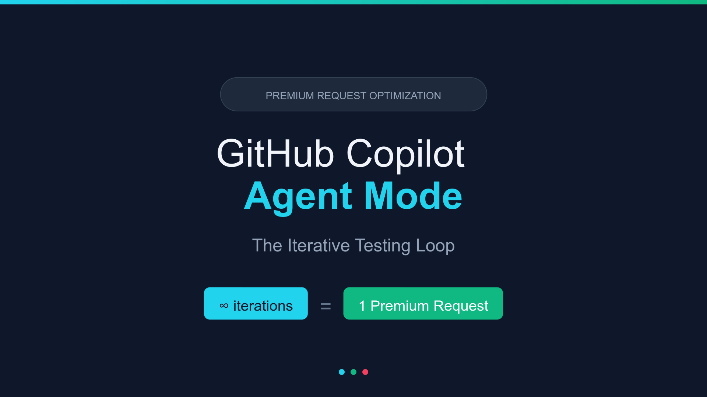
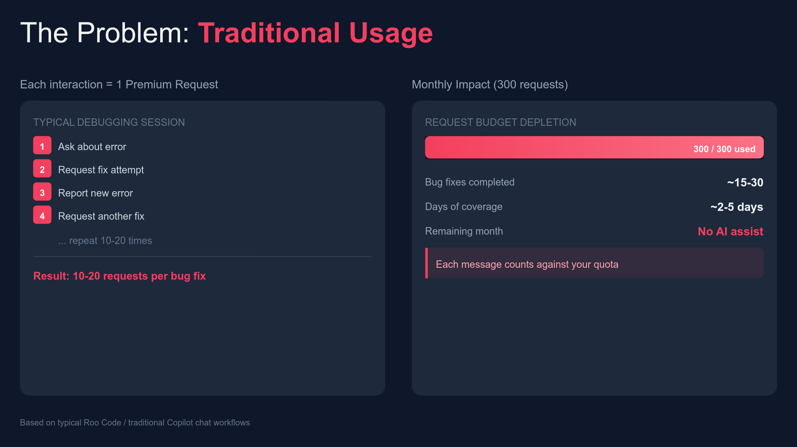
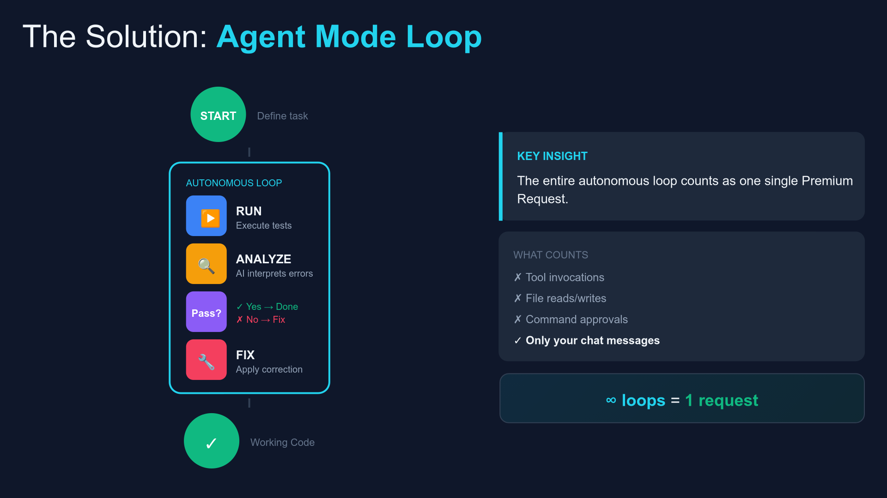
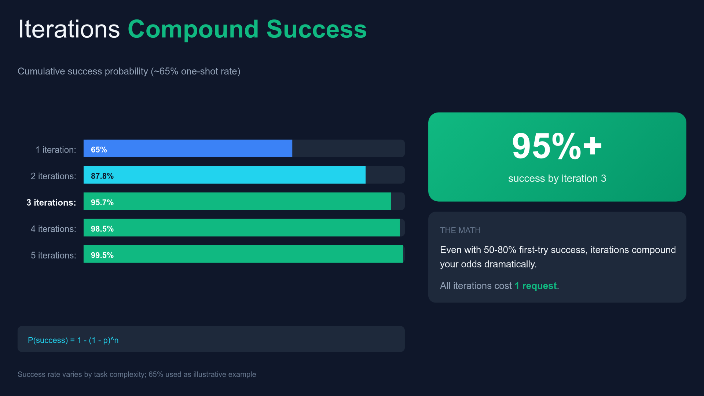
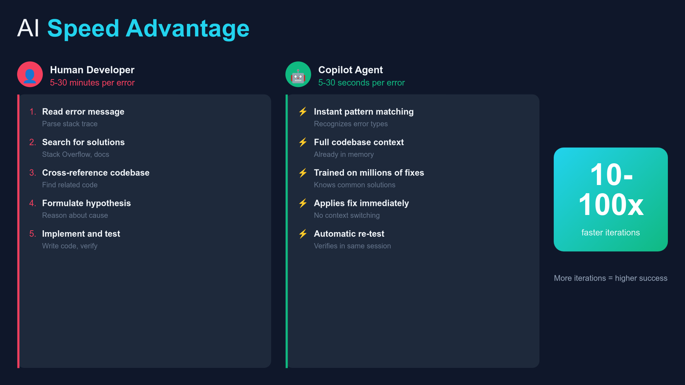
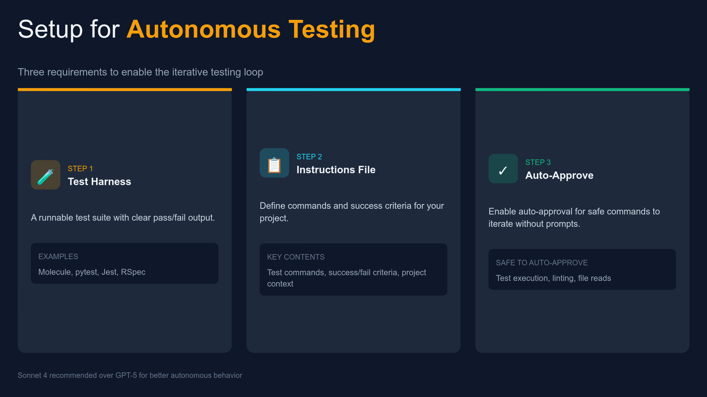
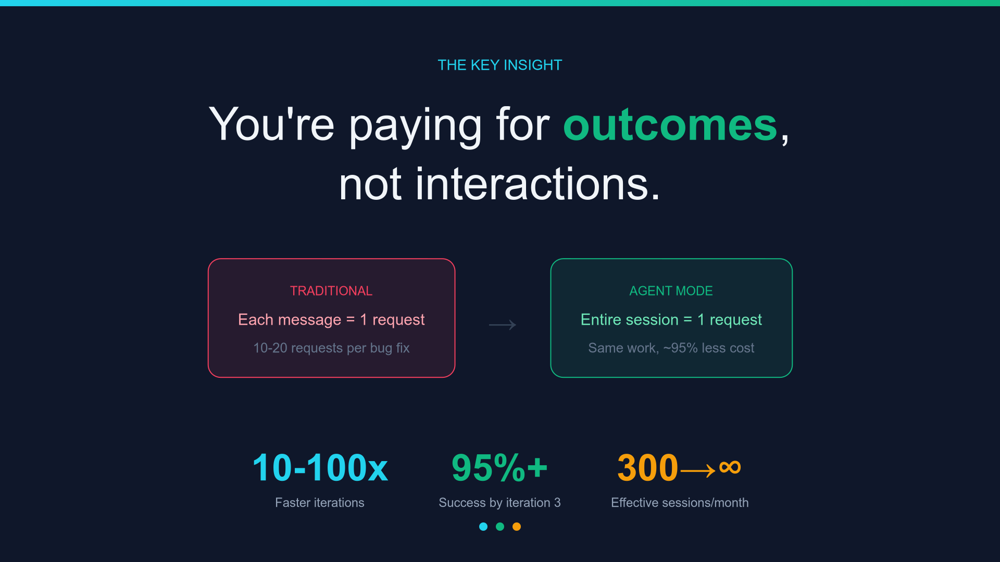
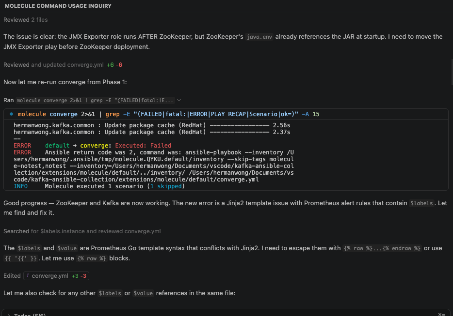
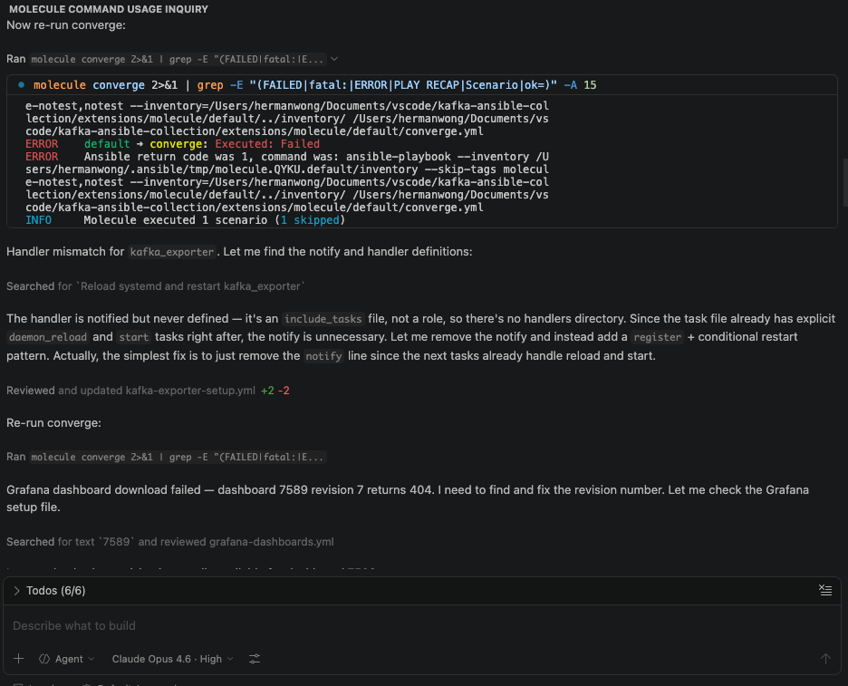

# AI-Assisted Development Workflow

This project was built using GitHub Copilot Agent Mode to demonstrate an efficient iterative development loop. Rather than treating AI as a simple autocomplete tool, the approach structures work as autonomous **setup → fix → test → analyze → repeat** cycles.

## The Core Idea

The key insight is that Copilot Agent Mode runs an entire autonomous loop — executing commands, reading errors, applying fixes, and re-testing — as a **single premium request**. This makes iterative debugging effectively free once a session starts.

## The Problem with Traditional Usage

In a traditional chat workflow, every message burns a premium request. A typical debugging session can consume 10–20 requests for a single bug fix, exhausting monthly quotas in days.

## The Solution: Agent Mode Loop

Agent Mode changes the economics entirely. Define the task, and the agent autonomously runs tests, analyzes errors, applies fixes, and re-tests — all within one request.

## Compound Success Through Iteration

Even with a modest ~65% one-shot success rate, multiple iterations within a single session compound to 95%+ success by the third attempt. All iterations cost one request.

## Speed Advantage

The agent processes errors in seconds (pattern matching, full codebase context, immediate fix application) compared to a human developer's 5–30 minute cycle of reading errors, searching for solutions, and formulating hypotheses.

## Setup Requirements

Three things are needed to enable the iterative testing loop:

1. **Test Harness** — A runnable test suite with clear pass/fail output (e.g., Molecule, pytest, Jest)
2. **Instructions File** — Define commands, success criteria, and project context
3. **Auto-Approve** — Enable auto-approval for safe commands (test execution, linting, file reads) so the agent can iterate without prompts

## The Key Insight

You're paying for **outcomes**, not interactions. One agent session that autonomously fixes a bug is worth more than 20 manual chat messages that each require context re-establishment.

## Copilot Chat in Action

The screenshots below show Copilot Agent Mode iterating through the development process on this project — running `molecule converge`, analyzing failures, applying fixes, and re-testing autonomously.

## Applying This to the Kafka Project

This entire Ansible collection — including the Prometheus/Grafana observability stack, Nginx reverse proxy, and Python traffic generator — was developed using this workflow. Molecule provided the test harness, `.github/copilot-instructions.md` provided project context, and the agent iterated through converge/verify cycles autonomously.
