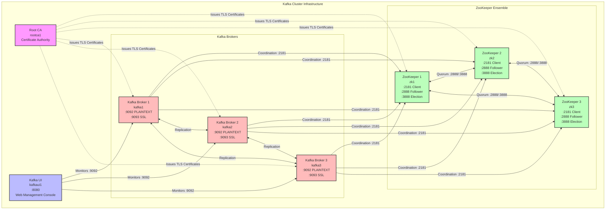

# Architecture Documentation

## Overview

This Ansible collection deploys a production-grade Apache Kafka cluster with ZooKeeper coordination and TLS security.

## Cluster Architecture



## Component Details

### Root CA (1 node)

- Generates self-signed CA certificate
- Issues TLS certificates for all cluster nodes
- Creates PKCS12 keystores for Java applications

### ZooKeeper Ensemble (3 nodes)

- Provides distributed coordination for Kafka
- Handles leader election and cluster membership
- Stores cluster metadata and configurations

**Ports:**
- 2181: Client connections
- 2888: Follower-to-leader communication
- 3888: Leader election

### Kafka Brokers (3 nodes)

- Store and serve messages
- Handle producer and consumer requests
- Replicate data across the cluster

**Ports:**
- 9092: PLAINTEXT listener
- 9093: SSL/TLS listener

### Kafka UI (1 node)

- Web-based management and monitoring interface
- Provides cluster visualization and topic management
- Monitors broker health and consumer groups
- Based on [Kafbat Kafka UI](https://github.com/kafbat/kafka-ui)

**Ports:**
- 8080: Web interface (accessible at [http://localhost:8080](http://localhost:8080))

**Configuration:**
- Connects to all Kafka brokers via PLAINTEXT (port 9092)
- Read-only mode can be enabled for safety
- Located at: [extensions/molecule/kafkaui-config.yml](../extensions/molecule/kafkaui-config.yml)

## Network Communication

### ZooKeeper Quorum

All ZooKeeper nodes communicate with each other:
- Port 2888 for follower-to-leader data sync
- Port 3888 for leader election

### Kafka to ZooKeeper

All Kafka brokers connect to ZooKeeper:
- Port 2181 for cluster coordination
- Connection string format: `zk1:2181,zk2:2181,zk3:2181`

### Kafka Inter-Broker

Brokers replicate data between each other:
- Uses configured listener (PLAINTEXT or SSL)
- Replication factor determines number of copies

### Kafka UI to Kafka Brokers

The Kafka UI connects to all brokers for monitoring:
- Port 9092 (PLAINTEXT) for cluster management
- Displays topics, partitions, consumer groups, and broker health
- No direct access to ZooKeeper (uses Kafka Admin API)

## TLS Security

When TLS is enabled:

1. **Root CA** generates certificates for all nodes
2. **Keystores** contain private keys and certificates
3. **Truststores** contain the CA certificate
4. All communication is encrypted

### Certificate Distribution

```
rootca1 generates:
  ├── ca.crt (CA certificate)
  ├── ca.key (CA private key)
  │
  └── For each node:
      ├── {hostname}.key (private key)
      ├── {hostname}.crt (signed certificate)
      └── {hostname}.p12 (PKCS12 keystore)
```

## Resource Requirements

### Minimum (Testing)

| Component | CPU | Memory | Storage |
|-----------|-----|--------|---------|
| ZooKeeper | 1 | 512MB | 10GB |
| Kafka | 1 | 1GB | 20GB |
| Kafka UI | 0.5 | 256MB | 1GB |

### Production

| Component | CPU | Memory | Storage |
|-----------|-----|--------|---------|
| ZooKeeper | 2 | 2GB | 50GB SSD |
| Kafka | 4 | 8GB | 500GB SSD |
| Kafka UI | 1 | 512MB | 5GB |

**Note:** Kafka UI is primarily used for monitoring and management. In production, it may be deployed separately or omitted entirely if not needed.
