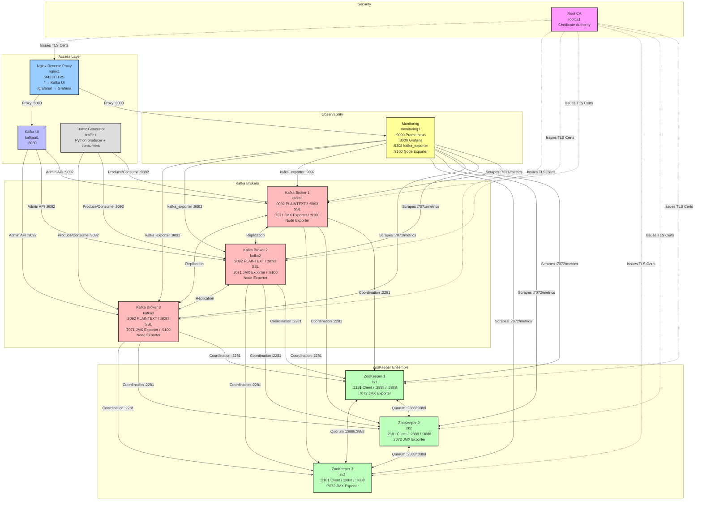
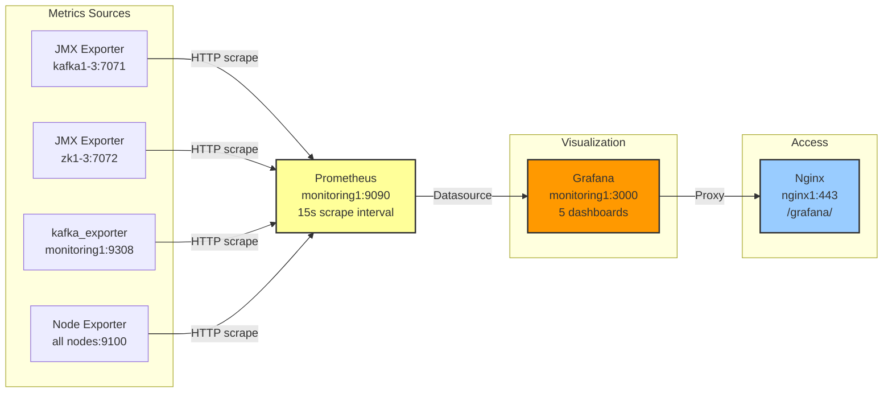

# Architecture Documentation

## Overview

This Ansible collection deploys a production-grade Apache Kafka cluster with ZooKeeper coordination, TLS security, and a full Prometheus/Grafana observability stack. The environment is tested using Ansible Molecule with Docker.

**Total nodes:** 11 (1 CA + 3 ZooKeeper + 3 Kafka + 1 Kafka UI + 1 Monitoring + 1 Nginx + 1 Traffic Generator)

---

## Cluster Architecture


```mermaid
graph TB
    subgraph "Security"
        CA[Root CA<br/>rootca1<br/>Certificate Authority]
    end

    subgraph "ZooKeeper Ensemble"
        ZK1[ZooKeeper 1<br/>zk1<br/>:2181 Client / :2888 / :3888<br/>:7072 JMX Exporter]
        ZK2[ZooKeeper 2<br/>zk2<br/>:2181 Client / :2888 / :3888<br/>:7072 JMX Exporter]
        ZK3[ZooKeeper 3<br/>zk3<br/>:2181 Client / :2888 / :3888<br/>:7072 JMX Exporter]
    end

    subgraph "Kafka Brokers"
        K1[Kafka Broker 1<br/>kafka1<br/>:9092 PLAINTEXT / :9093 SSL<br/>:7071 JMX Exporter / :9100 Node Exporter]
        K2[Kafka Broker 2<br/>kafka2<br/>:9092 PLAINTEXT / :9093 SSL<br/>:7071 JMX Exporter / :9100 Node Exporter]
        K3[Kafka Broker 3<br/>kafka3<br/>:9092 PLAINTEXT / :9093 SSL<br/>:7071 JMX Exporter / :9100 Node Exporter]
    end

    subgraph "Observability"
        MON[Monitoring<br/>monitoring1<br/>:9090 Prometheus<br/>:3000 Grafana<br/>:9308 kafka_exporter<br/>:9100 Node Exporter]
    end

    subgraph "Access Layer"
        NGX[Nginx Reverse Proxy<br/>nginx1<br/>:443 HTTPS<br/>/ → Kafka UI<br/>/grafana/ → Grafana]
        UI[Kafka UI<br/>kafkaui1<br/>:8080]
        TRF[Traffic Generator<br/>traffic1<br/>Python producer + consumers]
    end

    CA -.->|Issues TLS Certs| ZK1
    CA -.->|Issues TLS Certs| ZK2
    CA -.->|Issues TLS Certs| ZK3
    CA -.->|Issues TLS Certs| K1
    CA -.->|Issues TLS Certs| K2
    CA -.->|Issues TLS Certs| K3
    CA -.->|Issues TLS Certs| NGX

    ZK1 <-->|Quorum :2888/:3888| ZK2
    ZK2 <-->|Quorum :2888/:3888| ZK3
    ZK3 <-->|Quorum :2888/:3888| ZK1

    K1 -->|Coordination :2281| ZK1
    K1 -->|Coordination :2281| ZK2
    K1 -->|Coordination :2281| ZK3
    K2 -->|Coordination :2281| ZK1
    K2 -->|Coordination :2281| ZK2
    K2 -->|Coordination :2281| ZK3
    K3 -->|Coordination :2281| ZK1
    K3 -->|Coordination :2281| ZK2
    K3 -->|Coordination :2281| ZK3

    K1 <-->|Replication| K2
    K2 <-->|Replication| K3
    K3 <-->|Replication| K1

    MON -->|Scrapes :7071/metrics| K1
    MON -->|Scrapes :7071/metrics| K2
    MON -->|Scrapes :7071/metrics| K3
    MON -->|Scrapes :7072/metrics| ZK1
    MON -->|Scrapes :7072/metrics| ZK2
    MON -->|Scrapes :7072/metrics| ZK3
    MON -->|kafka_exporter :9092| K1
    MON -->|kafka_exporter :9092| K2
    MON -->|kafka_exporter :9092| K3

    UI -->|Admin API :9092| K1
    UI -->|Admin API :9092| K2
    UI -->|Admin API :9092| K3

    NGX -->|Proxy :3000| MON
    NGX -->|Proxy :8080| UI

    TRF -->|Produce/Consume :9092| K1
    TRF -->|Produce/Consume :9092| K2
    TRF -->|Produce/Consume :9092| K3

    style CA fill:#f9f,stroke:#333,stroke-width:2px
    style ZK1 fill:#bfb,stroke:#333,stroke-width:2px
    style ZK2 fill:#bfb,stroke:#333,stroke-width:2px
    style ZK3 fill:#bfb,stroke:#333,stroke-width:2px
    style K1 fill:#fbb,stroke:#333,stroke-width:2px
    style K2 fill:#fbb,stroke:#333,stroke-width:2px
    style K3 fill:#fbb,stroke:#333,stroke-width:2px
    style MON fill:#ff9,stroke:#333,stroke-width:2px
    style NGX fill:#9cf,stroke:#333,stroke-width:2px
    style UI fill:#bbf,stroke:#333,stroke-width:2px
    style TRF fill:#ddd,stroke:#333,stroke-width:2px
```

---

## Metrics Pipeline


```mermaid
graph LR
    subgraph "Metrics Sources"
        JK[JMX Exporter<br/>kafka1-3:7071]
        JZ[JMX Exporter<br/>zk1-3:7072]
        KE[kafka_exporter<br/>monitoring1:9308]
        NE[Node Exporter<br/>all nodes:9100]
    end

    PROM[Prometheus<br/>monitoring1:9090<br/>15s scrape interval]

    subgraph "Visualization"
        GF[Grafana<br/>monitoring1:3000<br/>5 dashboards]
    end

    subgraph "Access"
        NGX[Nginx<br/>nginx1:443<br/>/grafana/]
    end

    JK -->|HTTP scrape| PROM
    JZ -->|HTTP scrape| PROM
    KE -->|HTTP scrape| PROM
    NE -->|HTTP scrape| PROM
    PROM -->|Datasource| GF
    GF -->|Proxy| NGX

    style PROM fill:#ff9,stroke:#333,stroke-width:2px
    style GF fill:#f90,stroke:#333,stroke-width:2px
    style NGX fill:#9cf,stroke:#333,stroke-width:2px
```

---

## Component Details

### Root CA (1 node)

- Generates self-signed CA certificate and private key
- Issues TLS certificates for ZooKeeper, Kafka, and Nginx nodes
- Creates PKCS12 keystores for Java applications
- Certificate path: `/opt/kafka-ca/`

### ZooKeeper Ensemble (3 nodes)

- Provides distributed coordination and metadata store for Kafka
- Handles leader election and cluster membership
- JMX Exporter agent loaded at JVM startup for Prometheus metrics

**Ports:**

| Port | Purpose |
|------|---------|
| 2181 | Client connections (PLAINTEXT) |
| 2281 | Client connections (TLS) |
| 2888 | Follower-to-leader data sync |
| 3888 | Leader election |
| 7072 | JMX Exporter (Prometheus metrics) |
| 9100 | Node Exporter (system metrics) |

### Kafka Brokers (3 nodes)

- Store and serve messages across 3-node cluster
- Handle producer and consumer requests
- Replicate partitions with configurable replication factor
- JMX Exporter agent loaded at JVM startup for Prometheus metrics

**Ports:**

| Port | Purpose |
|------|---------|
| 9092 | PLAINTEXT listener |
| 9093 | SSL/TLS listener |
| 7071 | JMX Exporter (Prometheus metrics) |
| 9100 | Node Exporter (system metrics) |

### Monitoring Node (1 node)

Runs four observability services:

| Service | Port | Purpose |
|---------|------|---------|
| Prometheus | 9090 | Metrics collection and alerting |
| Grafana | 3000 | Dashboards and visualization |
| kafka_exporter | 9308 | Consumer group lag and broker count metrics |
| Node Exporter | 9100 | System metrics for the monitoring node itself |

**Prometheus scrape jobs:**

| Job | Targets | Metrics |
|-----|---------|---------|
| `kafka-jmx` | kafka1-3:7071 | Broker throughput, partitions, ISR, request handler |
| `zookeeper-jmx` | zk1-3:7072 | Latency, connections, znodes, watches |
| `kafka-exporter` | localhost:9308 | Consumer group lag, broker count, topic offsets |
| `node` | all nodes:9100 | CPU, memory, disk, network |
| `prometheus` | localhost:9090 | Prometheus self-metrics |

**Grafana dashboards:**

| Dashboard | Source | Covers |
|-----------|--------|--------|
| Kafka Broker Overview | File-provisioned JSON | Messages/bytes in/out, under-replicated partitions, active controller, request handler idle |
| Kafka Consumer Lag | File-provisioned JSON | Consumer group lag by group/topic, total lag, produce rate |
| ZooKeeper Overview | File-provisioned JSON | Outstanding requests, avg latency, connections, znode/watch count |
| Kafka Exporter Overview | Grafana Labs ID 7589 | Consumer group lag (kafka_exporter metrics) |
| Node Exporter Full | Grafana Labs ID 1860 | Full system metrics for all nodes |

**Alert rules:**

| Alert | Expression | Threshold |
|-------|------------|-----------|
| `KafkaBrokerDown` | `up{job="kafka-jmx"} == 0` | 1 minute |
| `UnderReplicatedPartitions` | `kafka_server_replicamanager_underreplicatedpartitions_value > 0` | 2 minutes |
| `ZooKeeperDown` | `up{job="zookeeper-jmx"} == 0` | 1 minute |
| `ConsumerGroupLag` | `kafka_consumergroup_lag_sum > 1000` | 5 minutes |

### Nginx Reverse Proxy (1 node)

- Terminates TLS using a certificate signed by the cluster Root CA
- Basic auth protects all routes (default: `admin` / `admin`)
- Kafka UI served at root `/` to avoid React sub-path asset loading issues
- Grafana served at `/grafana/` using Grafana's native `serve_from_sub_path` support

**Routing:**

| Path | Upstream | Notes |
|------|----------|-------|
| `/` | kafkaui1:8080 | Kafka UI at root avoids sub-path issues |
| `/grafana/` | monitoring1:3000 | Grafana configured with `serve_from_sub_path = true` |

**Ports:**

| Port | Purpose |
|------|---------|
| 80 | HTTP (redirects to HTTPS) |
| 443 | HTTPS (published to localhost) |
| 9100 | Node Exporter (system metrics) |

### Kafka UI (1 node)

- Web-based management and monitoring interface
- Based on [Kafbat Kafka UI](https://github.com/kafbat/kafka-ui)
- Accessible directly at `http://localhost:8080` or via Nginx at `https://localhost/`

**Port:** 8080 (published to localhost)

### Traffic Generator (1 node)

- Python service using `kafka-python` library
- Simulates realistic Kafka workloads for dashboard population
- Intentional variable consumer delays create measurable lag metrics

**Topics produced:**

| Topic | Purpose |
|-------|---------|
| `user-events` | Simulated user activity events |
| `order-processing` | Order lifecycle events |
| `analytics-data` | Analytics pipeline data |
| `notifications` | Notification messages |
| `system-logs` | System log entries |

**Consumer groups (with deliberate lag profiles):**

| Consumer Group | Topics | Delay |
|---------------|--------|-------|
| `analytics-consumer` | user-events, analytics-data | 1s |
| `audit-consumer` | user-events, order-processing, system-logs | 8s |
| `reporting-consumer` | order-processing, analytics-data, notifications | 15s |

---

## Network Communication

All containers share the `kafka-test-network` Docker bridge network. Hostnames resolve by container name.

### ZooKeeper Quorum

- Port 2888: follower-to-leader data sync
- Port 3888: leader election

### Kafka to ZooKeeper

- Port 2281 (TLS): cluster coordination
- Connection string: `zk1:2281,zk2:2281,zk3:2281`

### Kafka Inter-Broker Replication

- Uses SSL listener (port 9093) for inter-broker communication
- Replication factor: 3 (all brokers hold a copy of each partition)

### Metrics Scraping

Prometheus on `monitoring1` scrapes all targets over the internal Docker network — no external network access required.

---

## TLS Security

When TLS is enabled (default in Molecule tests):

1. **Root CA** generates certificates for ZooKeeper, Kafka, and Nginx nodes
2. **Keystores** (PKCS12 `.p12`) contain private keys and signed certificates
3. **Truststores** (JKS) contain the CA certificate for peer verification
4. ZooKeeper uses TLS client port 2281 (not 2181) for Kafka connections

### Certificate Distribution

```
rootca1 generates:
  ├── ca.crt         (CA certificate, distributed to all nodes)
  ├── ca.key         (CA private key, stays on rootca1)
  │
  └── Per node (zk1-3, kafka1-3, nginx1):
      ├── {hostname}.key  (private key)
      ├── {hostname}.crt  (signed certificate)
      └── {hostname}.p12  (PKCS12 keystore for Java)
```

---

## Resource Requirements

### Testing (Molecule / Docker)

| Component | CPU | Memory | Notes |
|-----------|-----|--------|-------|
| ZooKeeper (×3) | 0.5 | 512MB each | Heap: 512m |
| Kafka (×3) | 1 | 1GB each | Heap: 1g |
| Monitoring | 1 | 1GB | Prometheus + Grafana + exporters |
| Nginx | 0.25 | 128MB | |
| Traffic Generator | 0.25 | 256MB | Python process |
| Kafka UI | 0.5 | 512MB | Spring Boot app |

**Minimum host resources for full 11-node Molecule scenario:** 4 CPU cores, 8GB RAM, 20GB disk.

### Production

| Component | CPU | Memory | Storage |
|-----------|-----|--------|---------|
| ZooKeeper | 2 | 2GB | 50GB SSD |
| Kafka | 4 | 8GB | 500GB SSD |
| Monitoring | 2 | 4GB | 100GB (Prometheus TSDB) |
| Nginx | 1 | 256MB | — |
| Kafka UI | 1 | 512MB | 5GB |
